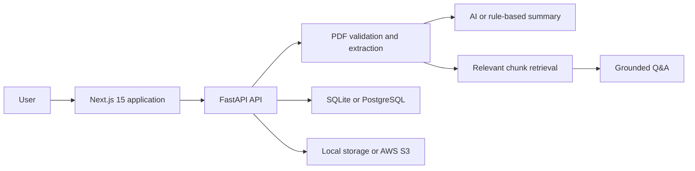

# AI Health Vault

> AI Health Vault is an AI-powered healthcare document intelligence platform that allows users to upload medical records, extract clinical information, summarize documents, and query their health history using natural language.

AI Health Vault is a full-stack healthcare SaaS portfolio project built with Next.js 15, TypeScript, Tailwind CSS, FastAPI, SQLAlchemy, PyMuPDF, and OpenAI APIs. It combines a polished public website with a responsive application workspace for document upload, AI summaries, record-grounded chat, medical record search, and a longitudinal health timeline.

> [!IMPORTANT]
> This repository is a portfolio demonstration, not medical advice software or a HIPAA-certified service. Use synthetic documents only unless the application has completed appropriate privacy, security, legal, and clinical review.

## Application Preview


## Problem Statement

Medical information is often fragmented across portals and difficult-to-read PDFs. Patients may technically have access to their records without having a practical way to organize them, identify important details, compare events over time, or search across their health history.

## Solution Overview

AI Health Vault converts text-based medical record PDFs into organized, searchable knowledge. The FastAPI service extracts text, generates a structured summary, stores the record, and retrieves relevant context for natural-language questions. The Next.js application presents that workflow through a production-style healthcare SaaS experience.

The current backend uses lightweight lexical retrieval and SQLite by default. It supports PostgreSQL and optional AWS S3 storage and is designed to evolve toward OpenAI embeddings and pgvector semantic search.

## Product Experience

### Public Website

- Responsive healthcare SaaS landing page
- Product features and pricing pages
- Login and signup experiences
- Contact, privacy policy, and terms pages
- Light and dark themes
- Professional navigation, footer, metadata, and mobile layouts

### Application Workspace

- Dashboard with record counts, summaries, recent questions, and timeline previews
- Drag-and-drop PDF upload with validation, progress, success, and error states
- Searchable and filterable medical records library
- Record-grounded AI chat with suggested questions and source labels
- Longitudinal health timeline
- Profile, security, notification, and data settings
- Empty states for new users and labeled synthetic fallbacks when APIs are unavailable

## Tech Stack

| Layer | Technology |
| --- | --- |
| Web application | Next.js 15 App Router, React 19, TypeScript |
| Styling | Tailwind CSS, responsive design, `next-themes` |
| UI | Reusable React components, Lucide icons |
| Backend | FastAPI, Python, Pydantic |
| PDF extraction | PyMuPDF |
| AI | OpenAI API with deterministic fallback |
| Retrieval | Lexical chunk retrieval in MVP; pgvector planned |
| Database | SQLite locally; PostgreSQL/Neon supported |
| File storage | Local filesystem or private AWS S3 |
| Deployment | Vercel, Render, Neon, AWS |

## Architecture Flow



See [docs/architecture.md](docs/architecture.md) for the current and target architecture.

## Pages

| Route | Purpose |
| --- | --- |
| `/` | Public landing page |
| `/features` | Detailed product capabilities |
| `/pricing` | SaaS pricing preview |
| `/login` | Login experience |
| `/signup` | Account creation experience |
| `/dashboard` | Health workspace overview |
| `/upload` | Medical record upload |
| `/records` | Searchable document library |
| `/chat` | AI health record assistant |
| `/timeline` | Longitudinal health timeline |
| `/settings` | Profile and settings |
| `/contact` | Product and collaboration contact |
| `/privacy` | Privacy policy |
| `/terms` | Terms of service |

## Repository Structure

```text
.
|-- architecture/          # Mermaid architecture source
|-- backend/               # FastAPI application and tests
|-- docs/                  # Architecture, deployment, and portfolio content
|-- frontend/
|   |-- app/               # Next.js App Router pages and layouts
|   |-- components/        # Shared marketing and application components
|   |-- lib/               # Typed API client, mock data, utilities
|   |-- .env.example
|   |-- next.config.ts
|   |-- tailwind.config.ts
|   `-- vercel.json
|-- screenshots/           # Synthetic-data portfolio screenshots
|-- .env.example           # Backend environment template
|-- .gitignore
|-- LICENSE
`-- README.md
```

## Local Setup

### Prerequisites

- Python 3.11+
- Node.js 20.19+ or 22.12+
- npm
- Optional: OpenAI API key, PostgreSQL database, and AWS S3 bucket

Clone the repository and create environment files:

```powershell
Copy-Item .env.example backend/.env
Copy-Item frontend/.env.example frontend/.env.local
```

The blank backend `DATABASE_URL` falls back to local SQLite.

## Environment Variables

### Frontend

| Variable | Required | Purpose |
| --- | --- | --- |
| `NEXT_PUBLIC_API_URL` | No | FastAPI base URL; defaults to `http://localhost:8000` |

### Backend

| Variable | Required | Purpose |
| --- | --- | --- |
| `OPENAI_API_KEY` | No | Enables model-generated summaries and answers |
| `DATABASE_URL` | No | SQLAlchemy URL; defaults to local SQLite when blank |
| `AWS_ACCESS_KEY_ID` | No | AWS credential for S3; prefer an IAM role in production |
| `AWS_SECRET_ACCESS_KEY` | No | AWS credential for S3; never commit a real value |
| `AWS_REGION` | For S3 | AWS region containing the bucket |
| `S3_BUCKET_NAME` | No | Enables private S3 persistence |
| `CORS_ORIGINS` | No | Comma-separated allowed frontend origins |

## Run the Backend

```powershell
cd backend
python -m venv .venv
.\.venv\Scripts\Activate.ps1
pip install -r requirements-dev.txt
uvicorn app.main:app --reload --port 8000
```

API documentation is available at `http://localhost:8000/docs`.

On macOS or Linux:

```bash
source .venv/bin/activate
```

## Run the Frontend

In a second terminal:

```powershell
cd frontend
npm install
npm run dev
```

Open `http://localhost:3000`.

## Validation

```powershell
cd backend
pytest

cd ../frontend
npm run typecheck
npm run build
npm audit
```

## Backend Integration Status

| Frontend workflow | Endpoint | Status |
| --- | --- | --- |
| List records | `GET /records` | Connected |
| Upload PDF | `POST /records/upload` | Connected |
| Ask records | `POST /ask` | Connected |
| Authentication | Not implemented | Demo UI with TODO |
| Timeline events | Not implemented | Synthetic fallback with TODO |
| Profile/settings | Not implemented | Demo persistence with TODO |
| Contact form | Not implemented | Demo success state with TODO |
| Billing/subscriptions | Not implemented | Pricing preview only |
| Record detail/delete | Not implemented | Summary modal only |

## Deployment

The recommended portfolio deployment uses:

- **Vercel** for the Next.js frontend
- **Render** for FastAPI
- **Neon PostgreSQL** for relational data
- **AWS S3** for private PDF storage

Follow the exact instructions in [docs/deployment.md](docs/deployment.md).

## Future Improvements

1. Add production authentication and per-user tenant isolation.
2. Replace lexical retrieval with OpenAI embeddings and pgvector.
3. Add OCR for scanned and handwritten documents.
4. Add normalized timeline-event APIs and source-page citations.
5. Add field-level encryption, audit logs, and document deletion workflows.
6. Add background jobs and malware scanning for uploads.
7. Add Stripe billing, entitlements, and usage metering.
8. Complete HIPAA, threat-modeling, legal, and clinical safety reviews.

## Resume-Ready Description

Built a full-stack healthcare document intelligence SaaS using Next.js 15, TypeScript, Tailwind CSS, FastAPI, PyMuPDF, SQLAlchemy, and OpenAI APIs, enabling PDF ingestion, structured clinical summaries, record-grounded Q&A, searchable document libraries, and longitudinal health timelines with PostgreSQL and AWS S3 deployment support.

Additional role-specific bullets are available in [docs/resume-bullets.md](docs/resume-bullets.md).

## License

Licensed under the [MIT License](LICENSE).
