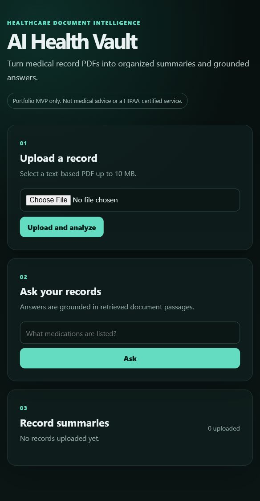
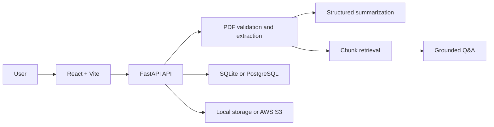

# AI Health Vault MVP

> AI Health Vault is an AI-powered healthcare document intelligence platform that allows users to upload medical records, extract clinical information, summarize documents, and query their health history using natural language.

AI Health Vault demonstrates an end-to-end document intelligence workflow with a React interface, FastAPI services, PDF text extraction, AI-assisted summarization, retrieval-grounded question answering, relational persistence, and optional AWS S3 file storage.

> [!IMPORTANT]
> This repository is a portfolio MVP, not medical advice software or a HIPAA-certified service. Use synthetic documents only unless the application has completed appropriate privacy, security, legal, and clinical review.

## Problem Statement

Medical information is often fragmented across portals and difficult-to-read PDFs. Patients may have access to their records without having a practical way to organize them, identify important clinical details, or search across their history.

## Solution Overview

The application accepts text-based medical record PDFs, extracts their contents with PyMuPDF, generates a structured summary, and stores the result for later review. Questions are matched to relevant document chunks before an optional OpenAI model produces an answer grounded only in retrieved record context.

The current MVP uses lightweight lexical retrieval and SQLite by default. It is designed to evolve toward OpenAI embeddings, PostgreSQL with pgvector, and production object storage.

## Application Preview



## Key Features

- PDF upload with type validation, size limits, and randomized storage names
- Clinical text extraction from text-based PDFs
- AI summaries with a deterministic rule-based fallback when no API key is configured
- Retrieval-grounded natural-language questions across uploaded records
- React dashboard for uploads, questions, and record summaries
- SQLite for zero-configuration local development
- PostgreSQL/Neon-compatible database configuration
- Optional encrypted-at-rest AWS S3 uploads
- Configurable CORS and frontend API endpoints for deployment

## Tech Stack

| Layer | Technology |
| --- | --- |
| Frontend | React, Vite, Axios |
| Backend | FastAPI, Python, Pydantic |
| PDF extraction | PyMuPDF |
| AI | OpenAI API with rule-based fallback |
| Retrieval | Lexical chunk retrieval in MVP; pgvector planned |
| Database | SQLite locally; PostgreSQL/Neon supported |
| File storage | Local filesystem or AWS S3 |
| Deployment | Vercel, Render, Neon, AWS |

## Architecture Flow



See [docs/architecture.md](docs/architecture.md) for the current and target architecture.

## Repository Structure

```text
.
|-- architecture/          # Diagram source and architecture assets
|-- backend/               # FastAPI application and tests
|-- docs/                  # Architecture, deployment, LinkedIn, and resume content
|-- frontend/              # React + Vite application
|-- screenshots/           # Portfolio screenshots
|-- .env.example           # Secret-free environment variable template
|-- .gitignore
|-- LICENSE
`-- README.md
```

## Local Setup

### Prerequisites

- Python 3.11+
- Node.js 20.19+ or 22.12+
- npm
- Optional: OpenAI API key, PostgreSQL database, and AWS S3 bucket

Clone the repository and create a local environment file:

```powershell
Copy-Item .env.example backend/.env
```

The blank `DATABASE_URL` in the template automatically falls back to local SQLite.

## Environment Variables

| Variable | Required | Purpose |
| --- | --- | --- |
| `OPENAI_API_KEY` | No | Enables model-generated summaries and answers |
| `DATABASE_URL` | No | SQLAlchemy URL; defaults to local SQLite when blank |
| `AWS_ACCESS_KEY_ID` | No | AWS credential for S3; prefer an IAM role in production |
| `AWS_SECRET_ACCESS_KEY` | No | AWS credential for S3; never commit a real value |
| `AWS_REGION` | For S3 | AWS region containing the bucket |
| `S3_BUCKET_NAME` | No | Enables S3 persistence when configured |
| `CORS_ORIGINS` | No | Comma-separated frontend origins |
| `VITE_API_URL` | No | Frontend API base URL; defaults to `http://localhost:8000` |

## Run the Backend

```powershell
cd backend
python -m venv .venv
.\.venv\Scripts\Activate.ps1
pip install -r requirements-dev.txt
uvicorn app.main:app --reload --port 8000
```

API documentation is available at `http://localhost:8000/docs`.

On macOS or Linux, activate the environment with:

```bash
source .venv/bin/activate
```

## Run the Frontend

In a second terminal:

```powershell
cd frontend
npm install
npm run dev
```

Open `http://localhost:5173`. For a deployed API, set `VITE_API_URL` in the frontend hosting environment.

## Tests and Build

```powershell
cd backend
pytest

cd ../frontend
npm run build
```

## Deployment

The recommended portfolio deployment uses Vercel for the frontend, Render for the API, Neon PostgreSQL for relational data, and AWS S3 for uploaded PDFs. Follow [docs/deployment.md](docs/deployment.md).

## Future Improvements

1. Replace lexical retrieval with OpenAI embeddings and pgvector similarity search.
2. Add OCR for scanned and handwritten documents.
3. Add authenticated user workspaces and row-level data isolation.
4. Encrypt sensitive database fields and add audit logging.
5. Add document deletion, retention policies, and S3 lifecycle rules.
6. Introduce background jobs for large-document processing.
7. Add evaluation datasets for summary quality and retrieval accuracy.
8. Complete HIPAA, threat-modeling, and clinical safety reviews before real-world use.

## Resume-Ready Description

Built an AI-powered healthcare document intelligence platform using React, FastAPI, PyMuPDF, SQLAlchemy, and OpenAI APIs to extract and summarize medical record PDFs and answer natural-language questions through a retrieval-grounded workflow, with PostgreSQL and AWS S3 deployment support.

Additional role-specific bullets are available in [docs/resume-bullets.md](docs/resume-bullets.md).

## License

Licensed under the [MIT License](LICENSE).
