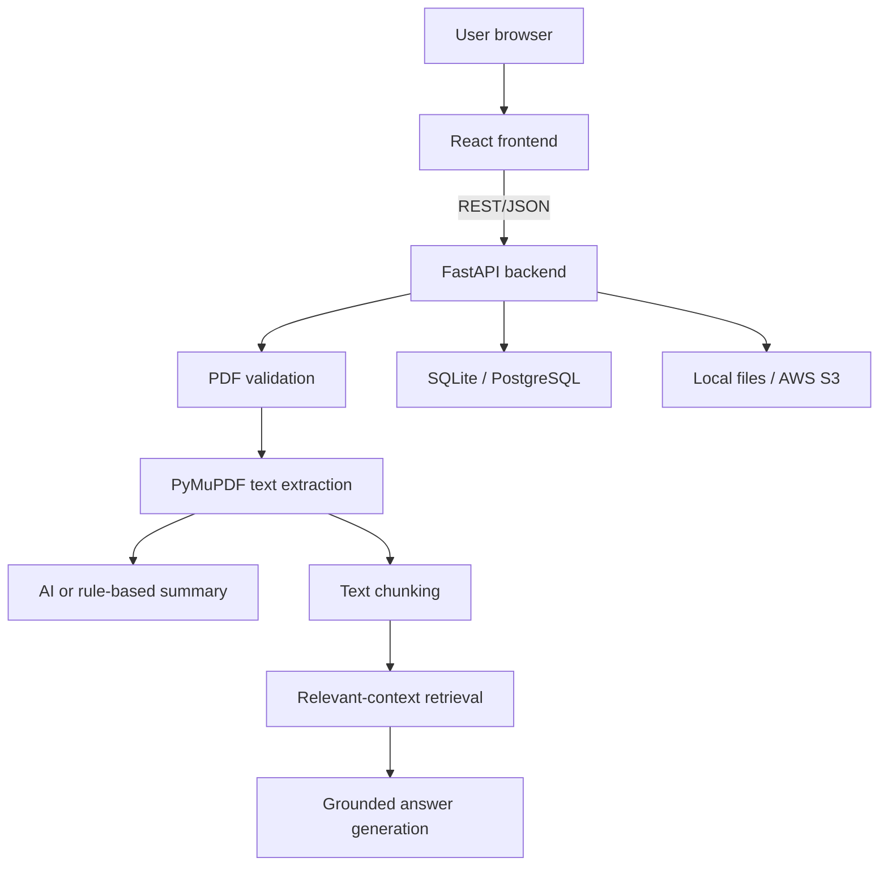

# Architecture

## Overview

AI Health Vault is split into a React client and a FastAPI service. The MVP keeps the application easy to run locally while exposing configuration points for managed PostgreSQL and AWS S3.

## React Frontend

The Vite-powered React client provides record upload, question entry, error handling, and summary display. `VITE_API_URL` selects the FastAPI origin at build time.

## FastAPI Backend

FastAPI exposes health, upload, record-listing, and question-answering endpoints. Pydantic manages request validation and environment-based settings. SQLAlchemy provides persistence across SQLite and PostgreSQL.

## PDF Extraction

Uploads are restricted to PDF files, checked for a PDF signature, limited to 10 MB by default, and stored under randomized names. PyMuPDF extracts text from text-based documents. Scanned PDFs require a future OCR stage.

## AI Summarization

When `OPENAI_API_KEY` is present, the backend asks an OpenAI model for a structured clinical summary. Without a key, a deterministic rules engine identifies common medication, allergy, diagnosis, and laboratory references.

## Vector Search and RAG

The current MVP chunks extracted records and ranks chunks with lexical term matching before answer generation. This is a lightweight retrieval-grounded workflow suitable for a portfolio demo.

The production target is:

1. Generate embeddings for each document chunk.
2. Store embeddings and metadata in PostgreSQL with pgvector.
3. Embed each user question.
4. Retrieve the highest-similarity chunks with user-level filters.
5. Pass only those chunks to the answer model.
6. Return source references alongside the answer.

## PostgreSQL and pgvector

SQLAlchemy supports a Neon PostgreSQL connection today. A future migration should add a chunk table with a pgvector embedding column, document ownership, source-page metadata, and vector indexes.

## AWS S3 Storage

When `S3_BUCKET_NAME` is configured, uploaded PDFs are written to an S3 `medical-records/` prefix with server-side AES-256 encryption. In production, use a private bucket, block public access, enable versioning, set lifecycle rules, and grant the API only the minimum required IAM permissions.

## Data Safety Boundary

The repository contains no real medical records. The MVP does not provide authentication, tenant isolation, comprehensive encryption, audit trails, consent management, or HIPAA compliance controls. Those are required before processing protected health information.
